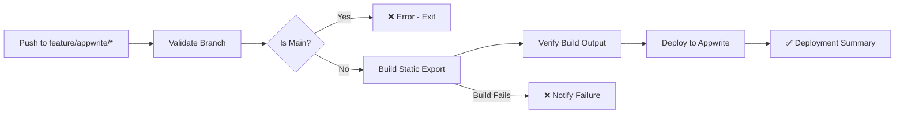

# Appwrite Deployment Guide

This guide covers automated deployment of SFPLiberate to Appwrite Cloud, a backend-as-a-service platform that provides hosting, authentication, and other features.

## Table of Contents

- [Overview](#overview)
- [Feature Flag Architecture](#feature-flag-architecture)
- [Prerequisites](#prerequisites)
- [Appwrite Project Setup](#appwrite-project-setup)
- [GitHub Secrets Configuration](#github-secrets-configuration)
- [Deployment Workflow](#deployment-workflow)
- [Branch Strategy](#branch-strategy)
- [Environment Management](#environment-management)
- [Troubleshooting](#troubleshooting)
- [Testing & Validation](#testing--validation)

## Overview

SFPLiberate uses a **feature flag-based deployment strategy** that allows:

- **Main branch**: Standalone Docker deployments only (no Appwrite references)
- **Feature branches**: Appwrite deployments with authentication and cloud features
- **Single codebase**: One unified codebase with environment-based feature toggles

### Key Benefits

- ✅ Clean separation between deployment modes
- ✅ No Appwrite dependencies in main releases
- ✅ Automated deployments via GitHub Actions
- ✅ Support for staging and production environments
- ✅ Feature flags control authentication, BLE proxy, and community features

## Feature Flag Architecture

The application uses the `DEPLOYMENT_MODE` environment variable to control features:

| Feature | Standalone | Appwrite |
|---------|-----------|----------|
| Authentication | ❌ Disabled | ✅ Enabled |
| Web Bluetooth | ✅ Enabled | ✅ Enabled |
| BLE Proxy | ✅ Enabled | ✅ Enabled |
| Community Features | ✅ Enabled | ✅ Enabled |
| Docker Container | ✅ Yes | ❌ No (static export) |
| Appwrite SDK | ❌ Not included | ✅ Included |

### Environment Variables

**Build-time variables** (set during `npm run build`):

```bash
# Deployment mode controls build output and feature availability
DEPLOYMENT_MODE=appwrite                      # or "standalone"
NEXT_PUBLIC_DEPLOYMENT_MODE=appwrite          # Client-side mode detection

# Appwrite-specific configuration
NEXT_PUBLIC_ENABLE_AUTH=true                  # Enable authentication UI
NEXT_PUBLIC_APPWRITE_ENDPOINT=https://cloud.appwrite.io/v1
NEXT_PUBLIC_APPWRITE_PROJECT_ID=your_project_id

# Feature flags
NEXT_PUBLIC_ENABLE_WEB_BLUETOOTH=true         # Web Bluetooth API
NEXT_PUBLIC_ENABLE_BLE_PROXY=true             # BLE proxy server
NEXT_PUBLIC_ENABLE_COMMUNITY_FEATURES=true    # Community module sharing

# Next.js configuration
NEXT_TELEMETRY_DISABLED=1                     # Disable Next.js telemetry
NODE_ENV=production                           # Production build mode
```

**Configuration files**:

- `frontend/next.config.ts`: Configures output mode (`export` for Appwrite, `standalone` for Docker)
- `frontend/src/lib/features.ts`: Feature detection helpers (`isAuthEnabled()`, `getDeploymentMode()`)
- `frontend/appwrite.json`: Appwrite CLI deployment configuration

## Prerequisites

Before deploying to Appwrite, ensure you have:

1. **Appwrite Cloud Account**
   - Sign up at https://cloud.appwrite.io
   - Create a new project or use an existing one

2. **GitHub Repository Access**
   - Admin access to configure secrets
   - Ability to create feature branches

3. **Appwrite CLI** (for local testing)
   ```bash
   npm install -g appwrite-cli
   ```

## Appwrite Project Setup

### 1. Create Appwrite Project

1. Log in to [Appwrite Cloud Console](https://cloud.appwrite.io)
2. Click "Create Project"
3. Enter project name: **SFPLiberate**
4. Note your **Project ID** (needed for GitHub secrets)

### 2. Configure Authentication

If using authentication features:

1. Navigate to **Auth** → **Settings**
2. Enable authentication methods:
   - Email/Password
   - OAuth providers (optional)
3. Configure session settings:
   - Session length: 365 days (or as needed)
   - Security: Enable additional factors as needed

### 3. Generate API Key

1. Navigate to **Overview** → **API Keys**
2. Click "Create API Key"
3. Configure key:
   - **Name**: GitHub Actions Deploy
   - **Scopes**: Select all required scopes (Functions, Static, Deployments)
   - **Expiration**: Never (or set appropriate expiry)
4. Copy the API key (you won't see it again!)

### 4. Note Project Details

You'll need these values for GitHub secrets:

- **Project ID**: Found in project overview (e.g., `65abc123def456`)
- **Endpoint URL**: `https://cloud.appwrite.io/v1` (for Cloud)
- **API Key**: Generated in previous step

## GitHub Secrets Configuration

Add the following secrets to your GitHub repository:

### Navigate to Repository Settings

1. Go to your GitHub repository
2. Click **Settings** → **Secrets and variables** → **Actions**
3. Click **New repository secret**

### Required Secrets

| Secret Name | Description | Example |
|-------------|-------------|---------|
| `APPWRITE_PROJECT_ID` | Your Appwrite project ID | `65abc123def456` |
| `APPWRITE_ENDPOINT_URL` | Appwrite API endpoint | `https://cloud.appwrite.io/v1` |
| `APPWRITE_API_KEY` | API key for deployments | `standard_abc123...` |

### Verify Secrets

After adding secrets, verify they appear in the secrets list:

```
✅ APPWRITE_PROJECT_ID
✅ APPWRITE_ENDPOINT_URL
✅ APPWRITE_API_KEY
```

## Deployment Workflow

The deployment is handled by `.github/workflows/deploy-appwrite.yml`.

### Workflow Overview



### Trigger Conditions

The workflow triggers on:

1. **Push to feature branches**:
   ```bash
   git push origin feature/appwrite-v1
   git push origin feat/appwrite-auth
   ```

2. **Manual workflow dispatch**:
   - Go to **Actions** → **Deploy to Appwrite**
   - Click **Run workflow**
   - Select branch and environment

### Workflow Steps

#### 1. Branch Validation

**Critical**: Prevents deployment from main branch:

```yaml
validate:
  steps:
    - name: Check branch
      run: |
        if [[ "${{ github.ref }}" == "refs/heads/main" ]]; then
          echo "❌ ERROR: Appwrite deployment not allowed from main"
          exit 1
        fi
```

#### 2. Build Static Export

Builds Next.js application with Appwrite feature flags:

```yaml
- name: Build static export
  env:
    DEPLOYMENT_MODE: appwrite
    NEXT_PUBLIC_DEPLOYMENT_MODE: appwrite
    NEXT_PUBLIC_ENABLE_AUTH: true
    NEXT_PUBLIC_APPWRITE_ENDPOINT: ${{ secrets.APPWRITE_ENDPOINT_URL }}
    NEXT_PUBLIC_APPWRITE_PROJECT_ID: ${{ secrets.APPWRITE_PROJECT_ID }}
  run: npm run build
```

**Output**: `frontend/out/` directory with static HTML/JS/CSS

#### 3. Verify Build Output

Validates that the build succeeded:

```yaml
- name: Verify build output
  run: |
    ls -la frontend/out/
    if [ ! -f "frontend/out/index.html" ]; then
      echo "❌ Build failed - no index.html"
      exit 1
    fi
```

#### 4. Deploy to Appwrite

Uses Appwrite CLI to deploy static files:

```yaml
- name: Deploy to Appwrite
  working-directory: ./frontend
  run: |
    appwrite deploy function \
      --function-id sfpliberate-frontend \
      --yes
```

## Branch Strategy

### Main Branch

**Never deploy Appwrite from main!** The main branch should only contain:

- ✅ Standalone Docker configuration
- ✅ Feature flag code (disabled by default)
- ✅ Documentation
- ❌ **NO** Appwrite deployments
- ❌ **NO** Appwrite environment variables in CI

### Feature Branches

Create feature branches for Appwrite deployments:

```bash
# Naming convention: feature/appwrite-* or feat/appwrite-*
git checkout -b feature/appwrite-v1
git checkout -b feat/appwrite-authentication
```

**Allowed branches**:
- `feature/appwrite-*`
- `feat/appwrite-*`

**Rejected branches**:
- `main` (explicitly blocked)
- `develop` (no Appwrite support)
- Any other branch pattern

### Example Workflow

```bash
# 1. Create feature branch
git checkout -b feature/appwrite-v1

# 2. Make changes (if needed)
# - Update frontend code
# - Test locally with DEPLOYMENT_MODE=appwrite

# 3. Commit and push
git add .
git commit -m "feat: prepare appwrite deployment"
git push origin feature/appwrite-v1

# 4. GitHub Actions automatically deploys to Appwrite
# 5. Monitor workflow at: https://github.com/YOUR_REPO/actions
```

## Environment Management

### Staging vs Production

The workflow supports two environments via manual dispatch:

#### Staging Deployment

```yaml
environment: staging
```

Use for:
- Testing new features
- QA validation
- Preview deployments

#### Production Deployment

```yaml
environment: production
```

Use for:
- Stable releases
- Public-facing deployment
- After staging validation

### Switching Environments

**Via GitHub UI**:
1. Go to **Actions** → **Deploy to Appwrite**
2. Click **Run workflow**
3. Select **environment**: `staging` or `production`
4. Click **Run workflow**

**Via GitHub CLI**:
```bash
# Deploy to staging
gh workflow run deploy-appwrite.yml \
  --ref feature/appwrite-v1 \
  --field environment=staging

# Deploy to production
gh workflow run deploy-appwrite.yml \
  --ref feature/appwrite-v1 \
  --field environment=production
```

## Troubleshooting

### Common Issues

#### 1. Deployment Fails on Main Branch

**Error**:
```
❌ ERROR: Appwrite deployment not allowed from main
```

**Solution**: Deploy from a feature branch:
```bash
git checkout -b feature/appwrite-v1
git push origin feature/appwrite-v1
```

#### 2. Missing GitHub Secrets

**Error**:
```
❌ ERROR: APPWRITE_PROJECT_ID is not set
```

**Solution**: Configure secrets in repository settings (see [GitHub Secrets Configuration](#github-secrets-configuration))

#### 3. Build Output Validation Fails

**Error**:
```
❌ Build failed - no index.html
```

**Causes**:
- Build errors in Next.js application
- Missing dependencies
- TypeScript errors

**Solution**:
```bash
# Test build locally
cd frontend
DEPLOYMENT_MODE=appwrite \
NEXT_PUBLIC_DEPLOYMENT_MODE=appwrite \
NEXT_PUBLIC_ENABLE_AUTH=true \
npm run build

# Check for errors
ls -la out/
```

#### 4. Appwrite CLI Authentication Fails

**Error**:
```
❌ ERROR: Invalid API key
```

**Causes**:
- API key expired
- Wrong project ID
- Insufficient scopes

**Solution**:
1. Generate new API key in Appwrite Console
2. Update `APPWRITE_API_KEY` secret in GitHub
3. Ensure API key has required scopes

### Debug Build Locally

Test Appwrite build on your machine:

```bash
cd frontend

# Set Appwrite environment variables
export DEPLOYMENT_MODE=appwrite
export NEXT_PUBLIC_DEPLOYMENT_MODE=appwrite
export NEXT_PUBLIC_ENABLE_AUTH=true
export NEXT_PUBLIC_APPWRITE_ENDPOINT=https://cloud.appwrite.io/v1
export NEXT_PUBLIC_APPWRITE_PROJECT_ID=your_project_id

# Install dependencies
npm ci --legacy-peer-deps

# Build
npm run build

# Verify output
ls -la out/
cat out/index.html | grep appwrite  # Should find Appwrite references
```

### View Workflow Logs

Access detailed logs in GitHub Actions:

1. Go to repository **Actions** tab
2. Click on the failing workflow run
3. Expand failed job steps
4. Review error messages and stack traces

### Validate appwrite.json

The `frontend/appwrite.json` file must be valid:

```bash
# Install jq for JSON validation
brew install jq  # macOS
apt install jq   # Linux

# Validate JSON syntax
cat frontend/appwrite.json | jq .

# Check required fields
jq '.projectId, .deployment.type' frontend/appwrite.json
```

## Testing & Validation

### Pre-Deployment Checks

Before deploying to Appwrite, verify:

- [ ] Feature branch name matches `feature/appwrite-*` or `feat/appwrite-*`
- [ ] GitHub secrets are configured correctly
- [ ] Local build succeeds with `DEPLOYMENT_MODE=appwrite`
- [ ] `appwrite.json` is valid JSON
- [ ] `next.config.ts` exports static files (`output: 'export'`)
- [ ] No hardcoded secrets in code (use environment variables)

### Post-Deployment Verification

After successful deployment:

1. **Check Deployment Status**
   - Go to GitHub Actions workflow run
   - Review deployment summary

2. **Test Application**
   - Visit Appwrite deployment URL (shown in summary)
   - Verify authentication UI appears (if enabled)
   - Test BLE connection (requires hardware)
   - Check browser console for errors

3. **Verify Feature Flags**
   ```javascript
   // Open browser console on deployed site
   console.log(window.ENV.DEPLOYMENT_MODE);  // Should be "appwrite"
   console.log(window.ENV.ENABLE_AUTH);      // Should be true
   ```

### Rollback Procedure

If deployment fails or issues are found:

1. **GitHub Actions**: Cancel running workflow
2. **Appwrite Console**:
   - Go to project → Functions → `sfpliberate-frontend`
   - Click **Deployments**
   - Revert to previous deployment
3. **Fix and Redeploy**:
   ```bash
   git revert HEAD
   git push origin feature/appwrite-v1
   ```

## Best Practices

### Security

- ✅ Never commit API keys or secrets to repository
- ✅ Use GitHub secrets for sensitive values
- ✅ Rotate API keys periodically
- ✅ Set appropriate API key expiration
- ✅ Use least-privilege scopes for API keys

### Development Workflow

- ✅ Test builds locally before pushing
- ✅ Use feature branches for all Appwrite deployments
- ✅ Deploy to staging first, then production
- ✅ Monitor workflow logs for issues
- ✅ Validate feature flags in deployed application

### Code Quality

- ✅ Keep feature flag logic in `frontend/src/lib/features.ts`
- ✅ Use environment variables for configuration
- ✅ Document Appwrite-specific code with comments
- ✅ Test both standalone and Appwrite modes locally

### Monitoring

- ✅ Review GitHub Actions workflow runs regularly
- ✅ Check Appwrite Console for deployment logs
- ✅ Monitor error rates in browser console
- ✅ Set up alerts for failed deployments

## Additional Resources

- [Appwrite Documentation](https://appwrite.io/docs)
- [Appwrite Cloud Console](https://cloud.appwrite.io)
- [Next.js Static Export](https://nextjs.org/docs/app/building-your-application/deploying/static-exports)
- [GitHub Actions Secrets](https://docs.github.com/en/actions/security-guides/encrypted-secrets)

## Support

For issues or questions:

1. Check this documentation
2. Review [Troubleshooting](#troubleshooting) section
3. Check GitHub Actions workflow logs
4. Open issue in repository with:
   - Workflow run URL
   - Error messages
   - Steps to reproduce

---

**Last Updated**: December 2024  
**Maintained By**: SFPLiberate Team
