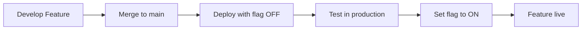

# Appwrite Sites Deployment Guide

> **⚠️ MAINTAINER-ONLY DOCUMENTATION**
>
> This guide is for the project maintainer deploying the public hosted instance.
> **Self-hosters**: Use `docker-compose up` instead - see main README.md

This guide explains how to deploy the SFPLiberate public instance to Appwrite Sites.

## Overview

Appwrite Sites provides three deployment methods:

1. **Git Auto-Deploy** (Recommended for production)
2. **Manual Upload** (GitHub Actions workflow)
3. **CLI Deployment** (Development workflow)

## Method 1: Git Auto-Deploy (Recommended)

### Why Use This?
- **Zero-configuration CI/CD**: Push to your production branch and Appwrite automatically builds and deploys
- **Preview deployments**: Non-production branches get preview URLs for testing
- **Built-in build environment**: No need to manage GitHub Actions runners
- **Automatic SSL**: Free SSL certificates for custom domains

### Setup Steps

1. **Create Appwrite Site** (if not already created):
   ```bash
   # Using Appwrite Console
   # Navigate to: Sites > Create Site > Connect GitHub
   ```

2. **Connect GitHub Repository**:
   - Go to Appwrite Console > Sites > Your Site
   - Navigate to Settings > Git Repository
   - Click "Connect Git" and authorize GitHub
   - Select repository: `SFPLiberate`
   - Choose production branch: `main`

3. **Configure Build Settings**:
   ```
   Framework: Next.js
   Build Runtime: Node 22
   Install Command: npm ci --legacy-peer-deps
   Build Command: npm run build
   Output Directory: out
   Adapter: Static
   ```

4. **Set Environment Variables**:
   In Appwrite Console > Sites > Your Site > Environment Variables:
   
   > **Note**: Appwrite automatically injects `APPWRITE_SITE_API_ENDPOINT` and `APPWRITE_SITE_PROJECT_ID`. The app automatically detects these - **no configuration needed for Appwrite endpoint/project!**
   
   ```bash
   # Backend API (Appwrite Function URL)
   APPWRITE_SITE_API_URL=https://api.sfpliberate.com
   
   # Feature Flags
   APPWRITE_SITE_ENABLE_AUTH=true
   APPWRITE_SITE_ENABLE_WEB_BLUETOOTH=true
   APPWRITE_SITE_ENABLE_BLE_PROXY=true
   APPWRITE_SITE_ENABLE_COMMUNITY_FEATURES=false  # Enable when ready
   
   # Build Configuration
   NEXT_TELEMETRY_DISABLED=1
   NODE_ENV=production
   ```
   
   **That's it!** You only need to set 5 variables. Appwrite provides the rest:
   - ✅ `APPWRITE_SITE_API_ENDPOINT` (auto-injected by Appwrite)
   - ✅ `APPWRITE_SITE_PROJECT_ID` (auto-injected by Appwrite)
   - ✅ `APPWRITE_SITE_NAME`, `APPWRITE_SITE_DEPLOYMENT`, etc. (auto-injected)
   
   See full list of auto-injected variables: https://appwrite.io/docs/products/sites/develop#appwrite-specific-environment-variables

5. **Deploy**:
   ```bash
   git checkout main
   git add .
   git commit -m "Update frontend"
   git push origin main
   ```

Appwrite will automatically:
- Detect the push
- Build your site
- Deploy to production (if production branch) or create preview (if other branch)

### Benefits
- ✅ Automatic deployments on push
- ✅ Preview deployments for pull requests
- ✅ Built-in CI/CD pipeline
- ✅ No GitHub Actions minutes consumed
- ✅ Free SSL certificates
- ✅ Global CDN included

## Method 2: Manual Upload (Current Workflow)

### When to Use
- Custom build processes
- Integration with other CI/CD tools
- Deploying from non-Git sources
- Testing before enabling auto-deploy

### GitHub Actions Workflow

The current `.github/workflows/deploy-appwrite.yml` uses this method:

```yaml
# 1. Build Next.js static export
npm run build

# 2. Package output directory
cd out
tar --exclude code.tar.gz -czf ../code.tar.gz .

# 3. Deploy via Sites API
const sites = new sdk.Sites(client);
const deployment = await sites.createDeployment({
  siteId: process.env.APPWRITE_SITE_ID,
  code: sdk.InputFile.fromPath('./code.tar.gz', 'code.tar.gz'),
  activate: true
});
```

### Required GitHub Secrets

Set these in GitHub repository settings:

| Secret | Description | Example |
|--------|-------------|---------|
| `APPWRITE_ENDPOINT_URL` | Your Appwrite API endpoint | `https://cloud.appwrite.io/v1` |
| `APPWRITE_PROJECT_ID` | Your project ID | `65f8a3b2e4d1f23` |
| `APPWRITE_API_KEY` | Server API key | `919c2d18fb5d4...` |
| `APPWRITE_SITE_ID` | Your site ID | `65f8a3b2e4d1f24` |

### How to Get Site ID

1. Go to Appwrite Console > Sites
2. Click on your site
3. Copy the ID from the URL: `/sites/site-{SITE_ID}`

Or use the API:
```bash
curl -X GET \
  'https://cloud.appwrite.io/v1/sites' \
  -H 'X-Appwrite-Project: YOUR_PROJECT_ID' \
  -H 'X-Appwrite-Key: YOUR_API_KEY'
```

### Trigger Deployment

```bash
# Push to any branch (workflow triggers on push)
git push origin <branch-name>

# Or manual trigger via GitHub CLI
gh workflow run deploy-appwrite.yml

# Or manual trigger via GitHub UI
# Go to Actions > Deploy to Appwrite Sites > Run workflow
```

> **Note**: This manual deployment method is useful for deploying from non-main branches or testing before enabling Git auto-deploy.

## Method 3: CLI Deployment

### When to Use
- Local development testing
- Quick manual deployments
- CI/CD systems other than GitHub Actions

### Setup

1. **Install Appwrite CLI**:
   ```bash
   npm install -g appwrite-cli
   ```

2. **Initialize Project**:
   ```bash
   cd frontend
   appwrite init sites
   ```

3. **Configure** (`appwrite.json`):
   ```json
   {
     "projectId": "YOUR_PROJECT_ID",
     "endpoint": "https://cloud.appwrite.io/v1",
     "sites": [
       {
         "$id": "YOUR_SITE_ID",
         "name": "SFPLiberate",
         "framework": "next-js",
         "buildRuntime": "node-22",
         "installCommand": "npm ci --legacy-peer-deps",
         "buildCommand": "npm run build",
         "outputDirectory": "./out",
         "adapter": "static"
       }
     ]
   }
   ```

4. **Deploy**:
   ```bash
   # Build and deploy
   npm run build
   appwrite push sites
   ```

### CLI Commands

```bash
# List sites
appwrite sites list

# Create deployment
appwrite sites createDeployment --siteId=YOUR_SITE_ID

# View deployment logs
appwrite sites listLogs --siteId=YOUR_SITE_ID

# Manage environment variables
appwrite sites createVariable --siteId=YOUR_SITE_ID --key=KEY --value=VALUE
```

## Comparison Matrix

| Feature | Git Auto-Deploy | Manual Upload | CLI Deployment |
|---------|-----------------|---------------|----------------|
| Setup Complexity | Low | Medium | Medium |
| Automatic CI/CD | ✅ Yes | ⚠️ Needs workflow | ❌ Manual |
| Preview Deployments | ✅ Yes | ❌ No | ❌ No |
| GitHub Actions Minutes | ✅ Zero | ⚠️ Uses minutes | ❌ N/A |
| Custom Build Steps | ⚠️ Limited | ✅ Full control | ✅ Full control |
| Best For | Production | Custom workflows | Local testing |

## Feature Flag Deployment Strategy

This project uses **feature flags** instead of branch-based deployments. All code is merged to `main`, and features are controlled via environment variables.

### How It Works

1. **Single Branch**: All code lives on `main` branch
2. **Environment Variables Control Features**: Set `NEXT_PUBLIC_ENABLE_*` flags to enable/disable features
3. **No Separate Staging**: Use feature flags to test features in production safely

### Available Feature Flags

```bash
# Enable/disable authentication (Appwrite Cloud only)
NEXT_PUBLIC_ENABLE_AUTH=true

# Enable/disable Web Bluetooth API (Chrome/Edge only)
NEXT_PUBLIC_ENABLE_WEB_BLUETOOTH=true

# Enable/disable BLE Proxy for iOS/Safari
NEXT_PUBLIC_ENABLE_BLE_PROXY=true

# Enable/disable community module features
NEXT_PUBLIC_ENABLE_COMMUNITY_FEATURES=true
```

### Deployment Workflow



### Example: Rolling Out a New Feature

```bash
# Step 1: Merge feature code to main with flag OFF
NEXT_PUBLIC_ENABLE_COMMUNITY_FEATURES=false

# Step 2: Deploy and verify code is stable
git push origin main

# Step 3: Enable feature for production
# Update environment variable in Appwrite Console:
NEXT_PUBLIC_ENABLE_COMMUNITY_FEATURES=true

# Step 4: Redeploy (Appwrite auto-redeploys on env var change)
```

### Benefits
- ✅ No complex branching strategies
- ✅ Test features in production environment safely
- ✅ Instant rollback by toggling flag
- ✅ Gradual rollouts possible
- ✅ Reduced merge conflicts

## Recommendations

### For Production
✅ **Use Git Auto-Deploy with Feature Flags**
- Connect your site to GitHub in Appwrite Console
- Set production branch to `main`
- Configure environment variables in Appwrite Console:
  - Simply prefix Appwrite's auto-injected variables: `NEXT_PUBLIC_APPWRITE_SITE_API_ENDPOINT=${APPWRITE_SITE_API_ENDPOINT}`
  - No need to manually copy endpoint/project ID!
  - App automatically detects and uses these variables
- Control feature visibility with feature flags (`NEXT_PUBLIC_ENABLE_*` variables)
- Merge all code to `main` with new features disabled by default
- Enable features via environment variables when ready
- Push to `main` to deploy

### For Development
✅ **Use CLI Deployment**
- Quick local testing
- No GitHub Actions overhead
- Iterate faster

### For Custom Workflows
✅ **Use Manual Upload (GitHub Actions)**
- Complex build requirements
- Multi-stage deployments
- Integration with other tools

## Troubleshooting

### Deployment Fails with "Site not found"
- Verify `APPWRITE_SITE_ID` is correct
- Check API key has permissions for Sites service

### Build Fails
- Check environment variables are set correctly
- Verify Node version matches build runtime (Node 22)
- Review build logs in Appwrite Console

### Git Auto-Deploy Not Triggering
- Verify GitHub app is installed and authorized
- Check repository is correctly connected in Appwrite Console
- Ensure push is to the configured production branch
- Review webhook logs in Appwrite Console

### "Cannot read property of undefined"
- Ensure all `NEXT_PUBLIC_*` environment variables are set
- Check frontend `.env.example` for required variables
- Verify Appwrite endpoint is using auto-injected `${APPWRITE_SITE_API_ENDPOINT}` variable

### Feature Not Visible After Deployment
- Verify feature flag is set to `true` in environment variables
- Check that environment variable has `NEXT_PUBLIC_` prefix (required for client-side access)
- Redeploy site after changing environment variables
- Clear browser cache and hard reload

## Additional Resources

- [Appwrite Sites Documentation](https://appwrite.io/docs/products/sites)
- [Deploy from Git Guide](https://appwrite.io/docs/products/sites/deploy-from-git)
- [Sites API Reference](https://appwrite.io/docs/references/cloud/server-nodejs/sites)
- [Appwrite CLI Documentation](https://appwrite.io/docs/tooling/command-line/sites)

## Next Steps

1. **Set up Git Auto-Deploy** for production deployments
2. Keep GitHub Actions workflow for custom scenarios
3. Configure environment variables in Appwrite Console
4. Set up custom domain (optional)
5. Enable CDN and SSL (automatic with Appwrite Sites)
