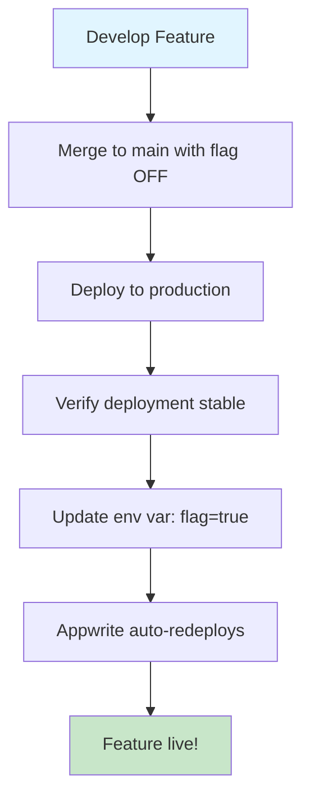

# Environment Variables Reference

This document lists all environment variables used in SFPLiberate.

## Quick Reference

### Docker Standalone (Self-Hosted) - DEFAULT

> **This is for users self-hosting via docker-compose**

Minimal configuration needed in `.env` (optional):

```bash
# Backend URL (Docker internal)
BACKEND_URL=http://backend

# Feature Flags (optional - sensible defaults)
ENABLE_WEB_BLUETOOTH=true
ENABLE_BLE_PROXY=true
ENABLE_COMMUNITY_FEATURES=false

# Development
NODE_ENV=production
```

**That's it!** Deployment mode is auto-detected. No Appwrite configuration needed.

### Appwrite Sites (Maintainer Only)

> **⚠️ MAINTAINER-ONLY: For public hosted instance deployment**

Set these in **Appwrite Console > Sites > Your Site > Environment Variables**:

```bash
# Backend API (Appwrite Function URL)
APPWRITE_SITE_API_URL=https://api.sfpliberate.com

# Feature Flags
APPWRITE_SITE_ENABLE_AUTH=true
APPWRITE_SITE_ENABLE_WEB_BLUETOOTH=true
APPWRITE_SITE_ENABLE_BLE_PROXY=true
APPWRITE_SITE_ENABLE_COMMUNITY_FEATURES=false

# Build Configuration
NEXT_TELEMETRY_DISABLED=1
NODE_ENV=production
```

**Auto-Injected by Appwrite** (no need to set):
- ✅ `APPWRITE_SITE_API_ENDPOINT`
- ✅ `APPWRITE_SITE_PROJECT_ID`
- ✅ `APPWRITE_SITE_NAME`, `APPWRITE_SITE_DEPLOYMENT`, etc.

### Local Development

Set these in `frontend/.env.local`:

```bash
# Deployment Mode
DEPLOYMENT_MODE=standalone
NEXT_PUBLIC_DEPLOYMENT_MODE=standalone

# Authentication
NEXT_PUBLIC_ENABLE_AUTH=false

# API Configuration
NEXT_PUBLIC_API_URL=http://localhost:8000

# Feature Flags
NEXT_PUBLIC_ENABLE_WEB_BLUETOOTH=true
NEXT_PUBLIC_ENABLE_BLE_PROXY=true
NEXT_PUBLIC_ENABLE_COMMUNITY_FEATURES=true  # Test all features locally

# Development
NODE_ENV=development
```

## Variable Descriptions

### Deployment Configuration

| Variable | Values | Description |
|----------|--------|-------------|
| `DEPLOYMENT_MODE` | `standalone`, `appwrite` | Server-side deployment mode flag |
| `NEXT_PUBLIC_DEPLOYMENT_MODE` | `standalone`, `appwrite` | Client-side deployment mode flag |
| `NODE_ENV` | `development`, `production` | Node.js environment |

### Authentication

| Variable | Values | Description |
|----------|--------|-------------|
| `NEXT_PUBLIC_ENABLE_AUTH` | `true`, `false` | Enable Appwrite authentication (Appwrite only) |

### Appwrite Configuration

**For Appwrite Sites** (auto-injected, recommended):
| Variable | Example | Description |
|----------|---------|-------------|
| `NEXT_PUBLIC_APPWRITE_SITE_API_ENDPOINT` | `${APPWRITE_SITE_API_ENDPOINT}` | Appwrite API endpoint (auto-detected from Appwrite Sites) |
| `NEXT_PUBLIC_APPWRITE_SITE_PROJECT_ID` | `${APPWRITE_SITE_PROJECT_ID}` | Appwrite project ID (auto-detected from Appwrite Sites) |

**For Manual/Local Config** (fallback):
| Variable | Example | Description |
|----------|---------|-------------|
| `NEXT_PUBLIC_APPWRITE_ENDPOINT` | `https://cloud.appwrite.io/v1` | Appwrite API endpoint (manual config) |
| `NEXT_PUBLIC_APPWRITE_PROJECT_ID` | `65f8a3b2e4d1f23` | Appwrite project ID (manual config) |

**How It Works**:
- The app **automatically prefers** `NEXT_PUBLIC_APPWRITE_SITE_*` variables (from Appwrite Sites auto-injection)
- Falls back to `NEXT_PUBLIC_APPWRITE_*` for manual deployments or local development
- On Appwrite Sites, simply prefix the auto-injected variables with `NEXT_PUBLIC_` to expose them to the client

**Other Auto-Injected Variables** (Appwrite Sites only):
| Variable | Description |
|----------|-------------|
| `APPWRITE_SITE_API_ENDPOINT` | Your Appwrite API endpoint (auto-injected by Appwrite) |
| `APPWRITE_SITE_PROJECT_ID` | Your project ID (auto-injected by Appwrite) |
| `APPWRITE_SITE_NAME` | Site name (auto-injected) |
| `APPWRITE_SITE_DEPLOYMENT` | Current deployment ID (auto-injected) |
| `APPWRITE_SITE_RUNTIME_NAME` | Runtime name, e.g., "node-22" (auto-injected) |
| `APPWRITE_SITE_RUNTIME_VERSION` | Runtime version (auto-injected) |

> **Usage**: Prefix with `NEXT_PUBLIC_` to expose to client: `NEXT_PUBLIC_APPWRITE_SITE_API_ENDPOINT=${APPWRITE_SITE_API_ENDPOINT}`

### API Configuration

| Variable | Example | Description |
|----------|---------|-------------|
| `NEXT_PUBLIC_API_URL` | `https://api.sfpliberate.com` | Backend API base URL |
| `BACKEND_URL` | `http://backend` | Internal backend URL (Docker only) |

### Feature Flags

| Variable | Default | Description |
|----------|---------|-------------|
| `NEXT_PUBLIC_ENABLE_WEB_BLUETOOTH` | `true` | Enable Web Bluetooth API (Chrome/Edge only) |
| `NEXT_PUBLIC_ENABLE_BLE_PROXY` | `true` | Enable BLE proxy service for iOS/Safari |
| `NEXT_PUBLIC_ENABLE_COMMUNITY_FEATURES` | `false` | Enable community module sharing |

### Build Configuration

| Variable | Values | Description |
|----------|--------|-------------|
| `NEXT_TELEMETRY_DISABLED` | `1`, `0` | Disable Next.js telemetry |

### Backend Configuration (Appwrite Functions)

These are set in **Appwrite Console > Functions > Your Function > Environment Variables**:

```bash
# Appwrite Configuration
APPWRITE_ENDPOINT=https://cloud.appwrite.io/v1
APPWRITE_PROJECT_ID=<your-project-id>
APPWRITE_API_KEY=<your-api-key>
APPWRITE_DATABASE_ID=sfp_library
APPWRITE_COLLECTION_ID=sfp_modules
APPWRITE_BUCKET_ID=sfp_eeprom_data
```

## Environment-Specific Guides

### Setting Up Appwrite Sites (Production)

1. **Navigate to Appwrite Console**:
   - Go to Sites > Your Site > Settings > Environment Variables

2. **Add Required Variables**:
   ```bash
   DEPLOYMENT_MODE=appwrite
   NEXT_PUBLIC_DEPLOYMENT_MODE=appwrite
   NEXT_PUBLIC_ENABLE_AUTH=true
   # Use auto-injected variables (no hardcoding needed!)
   NEXT_PUBLIC_APPWRITE_SITE_API_ENDPOINT=${APPWRITE_SITE_API_ENDPOINT}
   NEXT_PUBLIC_APPWRITE_SITE_PROJECT_ID=${APPWRITE_SITE_PROJECT_ID}
   NEXT_PUBLIC_API_URL=https://api.sfpliberate.com
   NEXT_PUBLIC_ENABLE_WEB_BLUETOOTH=true
   NEXT_PUBLIC_ENABLE_BLE_PROXY=true
   NEXT_PUBLIC_ENABLE_COMMUNITY_FEATURES=false
   NEXT_TELEMETRY_DISABLED=1
   NODE_ENV=production
   ```

3. **Redeploy**:
   - Push to main branch (if Git auto-deploy enabled)
   - Or manually trigger deployment

### Setting Up Docker (Self-Hosted)

1. **Create `.env` file** in `frontend/`:
   ```bash
   cp frontend/.env.example frontend/.env
   ```

2. **Edit values** for standalone mode (defaults are correct)

3. **Start services**:
   ```bash
   docker-compose up --build
   ```

### Setting Up Local Development

1. **Create `.env.local`** in `frontend/`:
   ```bash
   DEPLOYMENT_MODE=standalone
   NEXT_PUBLIC_DEPLOYMENT_MODE=standalone
   NEXT_PUBLIC_ENABLE_AUTH=false
   NEXT_PUBLIC_API_URL=http://localhost:8000
   NEXT_PUBLIC_ENABLE_WEB_BLUETOOTH=true
   NEXT_PUBLIC_ENABLE_BLE_PROXY=true
   NEXT_PUBLIC_ENABLE_COMMUNITY_FEATURES=true
   NODE_ENV=development
   ```

2. **Start backend**:
   ```bash
   cd backend
   uvicorn main:app --reload --port 8000
   ```

3. **Start frontend**:
   ```bash
   cd frontend
   npm run dev
   ```

## Feature Flag Strategy

### Rolling Out New Features



### Example Workflow

```bash
# 1. Code is ready, merge to main
git checkout main
git merge feature/new-community-feature

# 2. Feature flag is OFF in Appwrite Console
NEXT_PUBLIC_ENABLE_COMMUNITY_FEATURES=false

# 3. Push to main (auto-deploys via Git)
git push origin main

# 4. Verify deployment stable
# Check logs in Appwrite Console

# 5. Enable feature in Appwrite Console
# Update environment variable:
NEXT_PUBLIC_ENABLE_COMMUNITY_FEATURES=true

# 6. Appwrite automatically redeploys with new env var
# Feature is now live!
```

### Instant Rollback

```bash
# If issues arise, instantly disable feature:
NEXT_PUBLIC_ENABLE_COMMUNITY_FEATURES=false

# Appwrite auto-redeploys with feature disabled
# No code changes or Git operations needed!
```

## GitHub Secrets (Manual Deployment Workflow)

Set these in **GitHub Repository Settings > Secrets and variables > Actions**:

| Secret | Description | Example |
|--------|-------------|---------|
| `APPWRITE_ENDPOINT_URL` | Appwrite API endpoint | `https://cloud.appwrite.io/v1` |
| `APPWRITE_PROJECT_ID` | Your project ID | `65f8a3b2e4d1f23` |
| `APPWRITE_API_KEY` | Server API key | `919c2d18fb5d4...` |
| `APPWRITE_SITE_ID` | Your site ID | `65f8a3b2e4d1f24` |
| `PUBLIC_API_URL` | Public backend URL | `https://api.sfpliberate.com` |

> **Note**: GitHub secrets are only needed for manual deployment workflow. Git auto-deploy doesn't require GitHub secrets.

## Troubleshooting

### Variables Not Taking Effect

- **Appwrite Sites**: Trigger a redeploy after changing environment variables
- **Docker**: Restart containers with `docker-compose down && docker-compose up --build`
- **Local Dev**: Restart dev server (Next.js may cache `.env.local`)

### "Cannot read property of undefined" Errors

- Verify all `NEXT_PUBLIC_*` variables are set (these are exposed to client-side)
- Check browser console for specific missing variable
- Ensure variable names match exactly (case-sensitive)

### Feature Flags Not Working

- Confirm variable has `NEXT_PUBLIC_` prefix (required for client access)
- Check value is string `"true"` or `"false"` (not boolean)
- Clear browser cache and hard refresh
- Check environment in Appwrite Console matches deployed site

### Appwrite Auto-Injected Variables Not Available

- Only available in Appwrite Sites (not in local dev or Docker)
- Only available at runtime in deployed site
- Reference them using `${VARIABLE_NAME}` syntax in other env vars
- Check Appwrite Console > Sites > Settings > Environment Variables

## Additional Resources

- [Next.js Environment Variables](https://nextjs.org/docs/pages/building-your-application/configuring/environment-variables)
- [Appwrite Sites Environment Variables](https://appwrite.io/docs/products/sites/develop#appwrite-specific-environment-variables)
- [Docker Compose Environment Variables](https://docs.docker.com/compose/environment-variables/)
- [SFPLiberate Deployment Guide](./APPWRITE_SITES_DEPLOYMENT.md)
